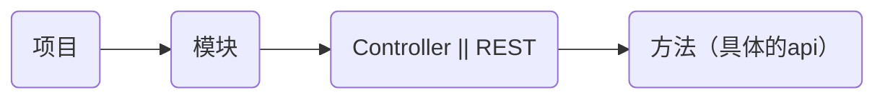

<div class='title'>NBA-API-使用帮助</div>

# Setting-Config

> 该功能是位于侧边栏的齿轮形状的图标

* 全局请求头配置
    * 又可叫做[本地请求头管理].
    * 配置数据只缓存在本地浏览器,不会存储到服务器上
    * ~~有效期为24小时~~ (2025.8.8) 一直有效
    * <span style="color:red">注:</span>API的局部请求头[Header]配置会覆盖全局的请求头配置。即局部的请求头优先级最高
* 远程请求环境配置
    * 用于配置环境对应的域名信息,例如name=生产,domain=www.pro.qq.com
    * 远程请求环境配置数据会同步存储到服务器,再所有成员间共享
* 本地请求环境配置
    * 用于配置环境对应的域名信息,例如name=生产,domain=www.pro.qq.com
    * 配置信息缓存在本地,只再本地使用,只对自己生效
    * 缓存有效期:理论上为永久有效
    * 注:本地请求环境不等于本地测试
* 全局执行次数配置
    * 配置对某一个API同时发起N次请求的执行次数
    * 只对本地生效,
    * 缓存有效期:理论上为永久有效
* 查看使用帮助
    * 详解介绍了当前项目的使用文档

# API管理

## API结构

> 建议如下



## 新建/编辑

> 对应API管理左上角的<span style="color:red">[加号(➕)]</span>图标,<br/>
> 以及选中目录或者API后右键菜单下的<span style="color:red">[编辑目录]</span>
> 和<span style="color:red">[新建子目录]</span>
> 以及<span style="color:red">[新建子API]</span>

| 	           | 值                   | 默认值 | 说明                                                                                            |
|-------------|---------------------|-----|-----------------------------------------------------------------------------------------------|
| 类型          | 目录/API              | 目录  | 标记当前新建的是目录还是API                                                                               |
| 父级          | API目录树              | 无   | 父级所在目录,用于控制层级关系                                                                               |
| 名称          | 名称                  | 无   | API或者目录的名称                                                                                    |
| 描述          | 描述                  | 无   | 对当前内容的简要描述                                                                                    |
| ContextPath | context-path        | 无   | 对应项目的server.servlet.context-path配置<br/>注:新建子级时会将父级的配置信息传递给子级。<br/>注:修改父级的配置信息时，不会修改已存在的子级配置信息 |
| Prefix      | Prefix              | 无   | 一般填写项目内Controller上统一的请求前缀<br/>注:新建子级时会将父级的配置信息传递给子级。<br/>注:修改父级的配置信息时，不会修改已存在的子级配置信息          |
| Method      | get/post/put/delete | 无   | API请求方法(当类型为API时必填)                                                                           |
| Path        | Path                | 无   | 一般填写Controller下method上的请求路径(当类型为API时必填)                                                       |
| SSE         | SSE                 | 关闭  | 是否采用SSE(Server-Sent Events)方法执行请求                                                             |
| WebSocket   | WebSocket           | 关闭  | 是否是websocket请求                                                                                |

## API树

* 支持通过[拖拽的方式]调整API的树结构关系

## API树右键菜单

> 功能如其名

* 刷新目录
* 编辑目录
* 删除目录
* 新建子目录
* 新建子API

## API树下拉菜单

* 分享已打开的API
    * 选择需要的API文档在右侧打开，然后通过该功能生成分享链接，进而分享打开的API
* 选择API
    * 使用此菜单后，API树会展示复选框□，勾选想要分享的API后，<br/>
      便可使用<span style="color:red">编辑API使用文档</span>菜单或者<span style="color:red">分享已选择的API</span>菜单
* 编辑API使用文档
    * 通过<span style="color:red">选择API</span>菜单选择需要的API，然后通过该菜单弹出API文档编辑弹框,进而为选中的这批API的编写详细使用文档
* 分享已选择的API
    * 通过<span style="color:red">选择API</span>菜单选择需要的API，然后通过该菜单便可生成分享链接
* 关闭API选择
    * 此菜单只有在使用<span style="color:red">选择API</span>菜单后,才会展示,作用是隐藏API选择的复选框

## API测试

> 选择一个创建后的API,单击即可再右侧打开,进而进行测试

* API 列表标签
    * 已打开的API
    * 如果API有变更,会有星号(*)提示,
    * 使用标签上的关闭API功能(×)时,会验证API是否有变更,如果有变更会提示保存
    * 右键菜单也有部分功能,详细使用文档查看<span style="color:red">[API 列表标签右键菜单]</span>
    * 支持拖拽标签页修改API的打开顺序
* API 路径
    * 请求方法: GET POST PUT DELETE
    * 请求环境: 包含本地请求环境配置信息,以及远程请求环境配置信息
    * Context-Path: 对应Context-Path
    * Prefix: 对应Prefix
    * Path: 对应Path
    * 支持 REST full api,详细使用文档查看<span style="color:red">[RESTful API 的使用]</span>
    * 执行和下拉菜单,详细使用文档查看<span style="color:red">[执行和下拉菜单]</span>
* API 配置
    * 配置API的详细信息,包含基础信息(Api Detail),请求头(Header),请求参数(Query),请求体(Body)
    * 详细使用文档查看<span style="color:red">[API 配置]</span>
* API 执行结果
    * 展示API测试结果,
        * 单次请求的响应结果(ResponseData),响应头(ResponseHeader)
        * 多次请求的结果需要<span style="color:red">[全局执行次数配置]</span>
          请求后,通过响应区的<span style="color:red">[结果N]</span>进行查看
    * 详细使用文档查看<span style="color:red">[API 执行结果]</span>

## API 列表标签右键菜单

* 关闭文档
* 关闭其他文档
* 关闭全部文档
* 关闭左侧文档
* 关闭右侧文档
* 顺序执行打开的API
    * 按照API打开的顺序,依次执行一次,可以通过选择对应的API标签页查看执行结果
* 并行执行打开的API
    * 同时对打开的API发起请求,仅请求一次,可以通过选择对应的API标签页查看执行结果

## RESTful API 的使用

> 本项目支持RESTful(Representational State Transfer)格式的API

* <span style="color:red">注:</span>路径内容用到的相关参数需要再Query内进行配置
* 例如:Path=/user/{id},则Query内需要配置id对应的参数信息

## 执行和下拉菜单

* 执行(执行一次)
    * 对API进行单次的调用,可以通过选择对应的API标签页查看执行结果
* 下拉菜单
    * 执行N次: 对API同时发起N次请求.可以通过[Setting-Config>全局执行次数配置]进行配置
    * 更新API: 修改API后,建议更新保存,可以通过 Ctrl+s/command+s快捷键触发更新
    * 同步API: 从数据库重新获取API配置信息
    * 预览API: 是一个API文档的概要描述
    * 分享API: 该菜单会生成一个API分享路径.
    * 复制路径: url路径

## API 配置

* Api Detail
    * 是否是SSE(Server-Sent Events)请求
    * name: 名称
    * desc: 描述
* Headers
    * 功能: 局部请求头配置
    * 字段: 参数名(请求头名称) 参数值 描述
    * <span style="color:red">注:</span>此处的局部请求头信息如果存在和全局请求头相同的参数名,则以局部请求头为准
* Query
    * 功能: 请求参数配置
    * 字段: 参数名 参数类型 参数值 描述
    * 预览 添加 删除 图标
    * 拖拽: 鼠标移动到列首,鼠标会变成上下拖拽的图标,可以对对应的列进行拖追排序
* Message
    * 功能: 进行WebSocket测试
    * 可自定义输入消息内容,可通过设置 json/text/xml 设置编辑器语言
    * 通过Binary控制发送消息时使用进行二进制编码
    * 发送按钮:发送消息
* Body
    * 功能: 请求体参数配置
    * content-type: application/json multipart/form-data application/x-www-form-urlencoded
        * application/json[json]: json格式的数据,支持JSON5语法,可以通过<span style="color:red">字段描述</span>功能添加字段文档
        * multipart/form-data[form-data]: 表单方式提交,可以上传文件
        * application/x-www-form-urlencoded[urlencoded]: ....
    * content-type=json
        * 参数编辑框支持JSON5数据格式
        * 有右键菜单,具体功能不详细描述
        * 可以通过快捷键(option+shift+f)格式化文档,具体快捷键可通过右键菜单查看
* Script
    * 功能: 参数格处理的js脚本
    * 提供一个函数名为buildParam的函数,发起请求前会调用这个函数,依次传递key value...
    * 提供一个函数名为buildMessage的函数,发送webSocket参数前,会调用该函数
    * buildParam 和 buildMessage 两个函数,具体描述请看下边的js代码

```js
// Script 参数处理脚本
/**
 * 处理Query Body(json/...)的参数
 * @param reqNum 第几次请求
 * @param key key
 * @param value value
 * @param path key路径
 * @param desc 描述
 * @param type 类型
 * @param check 是否选中
 * @returns {*}
 */
function buildParam(reqNum, key, value, path, desc, type, check) {
  console.log("build param script:", {reqNum, key, value, path, desc, type, check})
  return value;
}

/**
 * 对WebSocket参数进行处理
 * @param message
 * @returns {*}
 */
function buildMessage(message) {
  // 自定义参数处理
  return message;
}
```

## API 执行结果

* ResponseData: 单次请求结果的返回值
    * 可以通过<span style="color:red">响应字段描述</span>功能,添加返回值的描述文档信息
* ResponseHeader: 单次请求的响应头信息
* 结果: 执行多次次的响应数据展示,内包含{ResponseData,ResponseHeader},仅在<span style="color:red">[全局执行次数配置]</span>请求后展示
* <span style="color:red">注:</span>如果是下载文件类型的接口,返回值会变成{fileName:"fileName",download:点我保存}.可以通过点击[点我保存]完成文件下载

## 字段描述 || 响应字段描述

* 功能: 添加Body(json) 字段描述 或者添加响应字段描述
* 字段: 参数名 参数类型 描述
* 其他功能:
    * [Analysis Java Document With Swagger] 按钮
        * 该按钮可以提供将Java文件转换成文档的弹框功能,该弹框支持批量上传,拖拽上传,粘贴上传,以及点击上传;
        * Java文件必须是使用Swagger（ApiMode，ApiModelProperty）注解进行描述的;
        * 如果这个Java文件中的某个属性使用的是另外一个java文件，也可以一起选择上传，同样会自动进行关联解析;
        * 使用的Java文件最好是Lombok标注的,源码内没有get set函数,(暂未支持get set函数的解析)
    * [To Body Param] 按钮
        * 该按钮只有Body-json内的字段描述下才存在
        * 作用是将字段描述转换成对应的json参数

## 其他使用小技巧

### 本地测试以及参数值修改

> 安装了篡改猴插件以及脚本,和开启了本地校验,以及环境域名为 127.0.0.1 或者 localhost 时,认为是本地环境

* 本地环境测试,需要为浏览器安装<a href='https://www.tampermonkey.net/index.php' target="_blank">篡改猴</a>插件
* 允许运行用户脚本;找到插件,右键选择管理扩展程序,开启允许运行用户脚本
* 添加如下脚本

```js
// ==UserScript==
// @name         CORS Script
// @namespace    http://tampermonkey.net/
// @version      0.1
// @description  油猴跨域脚本
// @author       fusheng.zhang
// @match        192.168.18.192/view/pc_scmp/*
// @icon         data:image/gif;base64,R0lGODlhAQABAAAAACH5BAEKAAEALAAAAAABAAEAAAICTAEAOw==
// @grant        unsafeWindow
// @grant        GM.xmlHttpRequest
// @grant        GM_xmlhttpRequest
// ==/UserScript==

(function () {
  // 注: 修改 @match 为你自己的路径
  'use strict';
  // 支持本地测试
  unsafeWindow._GM_xmlHttpRequest = GM?.xmlHttpRequest || GM_xmlhttpRequest;
```

### API 文档同步

* 未打开API,API还在左侧列表树上
    * 如果API在其他端进行修改和保存,则在打开API时会获取最新的API信息
* API已打开,已经在右侧展示
    * 如果当前选中的API,在其他端进行了修改并保存,则左下角会弹出API同步的提示框,
    * 如果API未选中,在其他端进行了变更,然后我端重新选择API,同样会在左下角会弹出API同步的提示框,
        * 提示框展示5s,如果5s后还想同步,可以通过[同步API]功能同步.

# API使用文档

## 目录结构

> 按照前端的页面进行管理.或者按照功能管理.或者按照需求管理

## 新建/编辑

* 可以通过API管理的功能[**_选择API_**],批量选择多个API然后使用[**_编辑API使用文档_**]生成使用文档
* 也可以通过API使用文档的[**_新建子文档_**],关联多个API进而生成使用文档

## 注意

* 无论通过何种方式生成使用文档,都会先通过关联的api标识,去查询这一组api共同关联的使用文档
    * 如果存在共同的使用文档,则会回显该文档,否则就是新建api文档
* 即:一组api只能关联一个文档

# Api Swagger

> 对Swagger 文档的解析

# 定时任务调度中心

> 定时任务调度中心

* 支持Cron 表达式,以及RRULE规则表达式