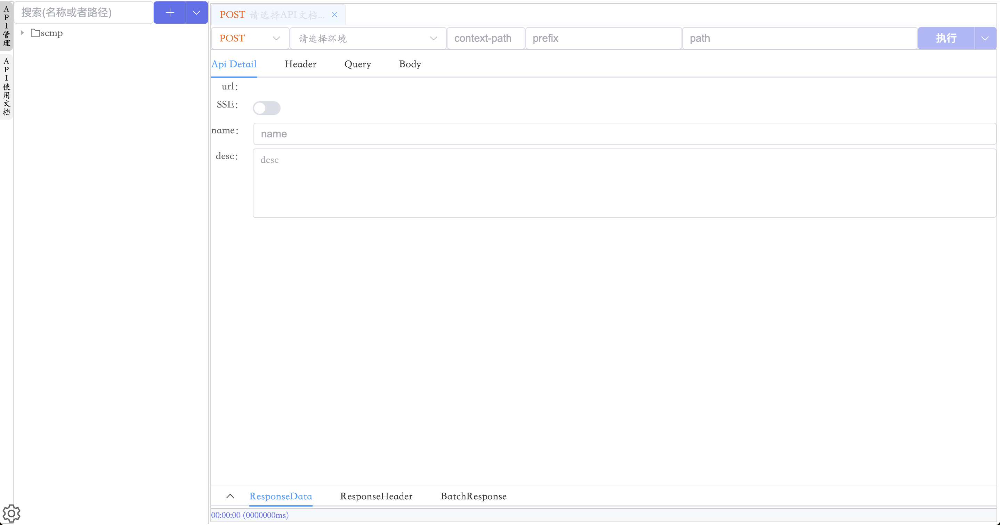
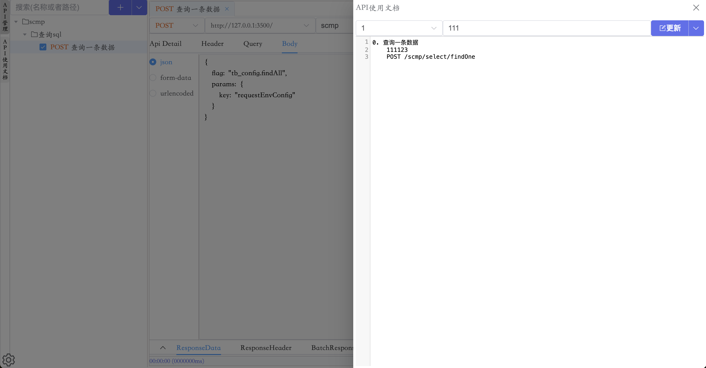
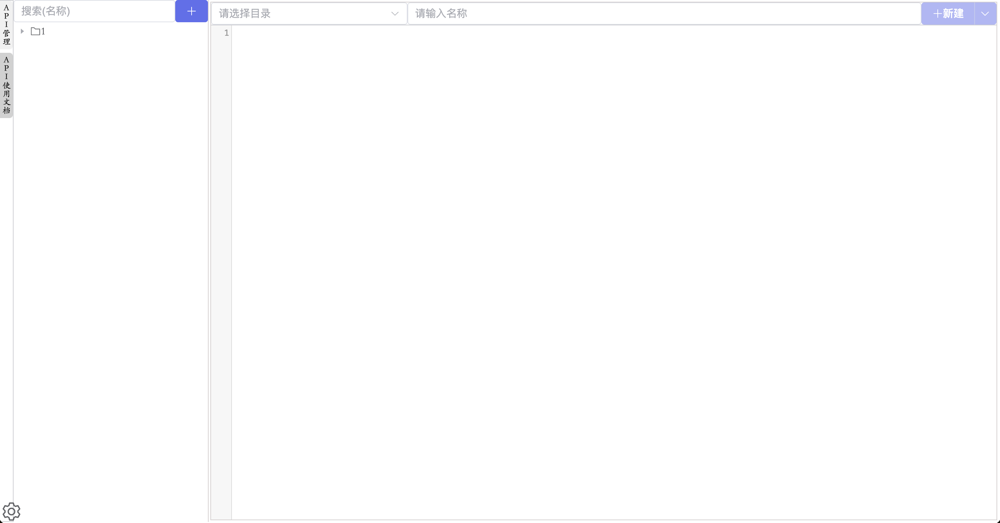
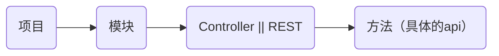

# 截图概览





# 本地部署

## 下载资源

下载本仓库即可,从source目录获取资源,包含 scmp.jar lib/other.zip sqlit-db.db static

## 释放资源

```shell
# 在lib目录下新建other目录，将other.zip的内容解压到other目录下。lib/other/*.jar
cd ./lib && mkdir other 
cd other && cp ../other.zip ./
unzip other.zip && rm -rf other.zip
```

## 启动脚本

```shell
java -jar scmp.jar \
	--db.type=sqlit \
	--spring.datasource.url=jdbc:sqlite:./sqlit-db.db \ # 配置为你的salit-db.db 路径
	--project.location-file-path=file:./static/ \ # 配置为你的static目录路径
	--spring.profiles.active=pro >/dev/null 2>&1 & # 如果要控制台启动，可以不使用这一行，同时注意去掉上一行结果的反斜杠/
```

# 此项目也可以支持服务器部署，如有需要同我联系

邮箱：17610759800@163.com qq:1270622569 微信: zfs1270622569

## 访问

[http://127.0.0.1:3500/scmp/static/index.html#/request/api](http://192.168.18.191:3500/scmp/static/index.html#/request/api)

# Setting-Config

> 该功能是位于左下角的的齿轮形状的图标

* 全局请求头管理
  * 又可叫做[本地请求头管理].
  * 配置数据只缓存在本地浏览器,不会存储到服务器上
  * 有效期为24小时
  * <span style="color:red">注:</span>API的局部请求头[Header]配置会覆盖全局的请求头配置。即局部的请求头优先级最高
* 远程请求环境管理
  * 用于配置环境对应的域名信息,例如name=生产,domain=www.pro.qq.com
  * 远程请求环境配置数据会同步存储到服务器,再所有成员间共享
* 本地请求环境管理
  * 用于配置环境对应的域名信息,例如name=生产,domain=www.pro.qq.com
  * 配置信息缓存在本地,只再本地使用,只对自己生效
  * 缓存有效期:理论上为永久有效
  * 注:本地请求环境不等于本地测试
* 执行N次配置
  * 配置对某一个API同时发起N次请求的执行次数
  * 只对本地生效,
  * 缓存有效期:理论上为永久有效
* 使用帮助
  * 详解介绍了当前项目的使用文档

# API管理

## (建议)API结构



## 新建/编辑

> 对应API管理左上角的<span style="color:red">[加号(➕)]</span>图标,<br/>
> 以及选中目录或者API后右键菜单下的<span style="color:red">[编辑目录]</span>
> 和<span style="color:red">[新建子目录]</span>
> 以及<span style="color:red">[新建子API]</span>

| 	           | 值                   | 默认值 | 说明                                                                                            |
|-------------|---------------------|-----|-----------------------------------------------------------------------------------------------|
| 类型          | 目录/API              | 目录  | 标记当前新建的是目录还是API                                                                               |
| 父级          | API目录树              | 无   | 父级所在目录,用于控制层级关系                                                                               |
| 名称          | 名称                  | 无   | API或者目录的名称                                                                                    |
| 描述          | 描述                  | 无   | 对当前内容的简要描述                                                                                    |
| ContextPath | context-path        | 无   | 对应项目的server.servlet.context-path配置<br/>注:新建子级时会将父级的配置信息传递给子级。<br/>注:修改父级的配置信息时，不会修改已存在的子级配置信息 |
| 前缀          | 前缀                  | 无   | 一般填写项目内Controller上统一的请求前缀<br/>注:新建子级时会将父级的配置信息传递给子级。<br/>注:修改父级的配置信息时，不会修改已存在的子级配置信息          |
| 方法          | get/post/put/delete | 无   | API请求方法(当类型为API时必填)                                                                           |
| 路径          | 路径                  | 无   | 一般填写Controller下method上的请求路径(当类型为API时必填)                                                       |
| SSE         | SSE                 | 关闭  | 是否采用SSE(Server-Sent Events)方法执行请求                                                             |

## API树

* 支持通过[拖拽的方式]调整API的树结构关系

## API管理树右键菜单

> 功能如其名

* 刷新目录
* 编辑目录
* 删除目录
* 新建子目录
* 新建子API

## API管理下拉菜单

* 分享已打开的API
  * 选择需要的API文档在右侧打开，然后通过该功能生成分享链接，进而分享打开的API
* 选择API
  * 使用此菜单后，API树会展示复选框□，勾选想要分享的API后，<br/>
    便可使用<span style="color:red">编辑API使用文档</span>菜单或者<span style="color:red">分享已选择的API</span>菜单
* 编辑API使用文档
  * 通过<span style="color:red">选择API</span>菜单选择需要的API，然后通过该菜单弹出API文档编辑弹框,进而为选中的这批API的编写详细使用文档
* 分享已选择的API
  * 通过<span style="color:red">选择API</span>菜单选择需要的API，然后通过该菜单便可生成分享链接
* 关闭API选择
  * 此菜单只有在使用<span style="color:red">选择API</span>菜单后,才会展示,作用是隐藏API选择的复选框

## API测试

> 选择一个创建后的API,单击即可再右侧打开,进而进行测试

* API 列表标签
  * 已打开的API
  * 如果API有变更,会有星号(*)提示,
  * 使用标签上的关闭API功能(×)时,会验证API是否有变更,如果有变更会提示保存
  * 右键菜单也有部分功能,详细使用文档查看<span style="color:red">[API 列表标签右键菜单]</span>
  * 支持拖拽标签页修改API的打开顺序
* API 路径
  * 请求方法: GET POST PUT DELETE
  * 请求环境: 包含本地请求环境配置信息,以及远程请求环境配置信息
  * Context-Path: 对应Context-Path
  * Prefix: 对应Prefix
  * Path: 对应Path
  * 支持 REST full api,详细使用文档查看<span style="color:red">[RESTful API 的使用]</span>
  * 执行和下拉菜单,详细使用文档查看<span style="color:red">[执行和下拉菜单]</span>
* API 配置
  * 配置API的详细信息,包含基础信息(Api Detail),请求头(Header),请求参数(Query),请求体(Body)
  * 详细使用文档查看<span style="color:red">[API 配置]</span>
* API 执行结果
  * 展示API测试结果,
    * 单次请求的响应结果(ResponseData),响应头(ResponseHeader)
    * 多次请求的结果需要<span style="color:red">[执行N次]</span>
      请求后,通过响应区的<span style="color:red">[结果N]</span>进行查看
  * 详细使用文档查看<span style="color:red">[API 执行结果]</span>

## API 列表标签右键菜单

* 关闭文档
* 关闭其他文档
* 关闭全部文档
* 关闭左侧文档
* 关闭右侧文档
* 顺序执行打开的API
  * 按照API打开的顺序,依次执行一次,可以通过选择对应的API标签页查看执行结果
* 并行执行打开的API
  * 同时对打开的API发起请求,仅请求一次,可以通过选择对应的API标签页查看执行结果

## RESTful API 的使用

> 本项目支持RESTful(Representational State Transfer)格式的API

* <span style="color:red">注:</span>路径内容用到的相关参数需要再Query内进行配置
* 例如:Path=/user/{id},则Query内需要配置id对应的参数信息

## 执行和下拉菜单

* 执行(执行一次)
  * 对API进行单次的调用,可以通过选择对应的API标签页查看执行结果
* 下拉菜单
  * 预览API: 是一个API文档的概要描述
  * 执行N次: 对API同时发起N次请求.N可以通过[Setting-Config>执行N次配置]进行配置
  * 更新API
  * 分享API
    * 该菜单会生成一个API分享路径.
  * 复制路径

## API 配置

* Api Detail
  * 是否是SSE(Server-Sent Events)请求
  * name: 名称
  * desc: 描述
* Headers
  * 功能: 局部请求头配置
  * 字段: 参数名(请求头名称) 参数值 描述
  * <span style="color:red">注:</span>此处的局部请求头信息如果存在和全局请求头相同的参数名,则以局部请求头为准
* Query
  * 功能: 请求参数配置
  * 字段: 参数名 参数类型 参数值 描述
  * 预览 添加 删除 图标
  * 拖拽: 鼠标移动到列首,鼠标会变成上下拖拽的图标,可以对对应的列进行拖追排序
* Body
  * 功能: 请求体参数配置
  * content-type: application/json multipart/form-data application/x-www-form-urlencoded
    * application/json[json]: json格式的数据,可以通过<span style="color:red">字段描述</span>功能添加字段文档
    * multipart/form-data[form-data]: 表单方式提交,可以上传文件
    * application/x-www-form-urlencoded[urlencoded]: ....

## API 执行结果

* ResponseData: 单次请求结果的返回值
  * 可以通过<span style="color:red">响应字段描述</span>功能,添加返回值的描述文档信息
* ResponseHeader: 单次请求的响应头信息
* 结果N: 执行N次的响应数据展示,内包含{ResponseData,ResponseHeader},仅在<span style="color:red">[执行N次]</span>请求后展示
* <span style="color:red">注:</span>如果是下载文件类型的接口,返回值会变成{fileName:"fileName",download:点我保存}.可以通过点击[点我保存]完成文件下载

## 字段描述 || 响应字段描述

* 功能: 添加Body(json) 字段描述 或者添加响应字段描述
* 字段: 参数名 参数类型 描述
* 其他功能:
  * [Analysis Java Document With Swagger] 按钮
    * 该按钮可以提供将Java文件转换成文档的弹框功能,该弹框支持批量上传,拖拽上传,粘贴上传,以及点击上传;
    * Java文件必须是使用Swagger（ApiMode，ApiModelProperty）注解进行描述的;
    * 如果这个Java文件中的某个属性使用的是另外一个java文件，也可以一起选择上传，同样会自动进行关联解析;
    * 使用的Java文件最好是Lombok标注的,源码内没有get set函数,(暂未支持get set函数的解析)
  * [To Body Param] 按钮
    * 该按钮只有Body-json内的字段描述下才存在
    * 作用是将字段描述转换成对应的json参数

## 其他使用小技巧

### 本地测试以及参数值修改

> 安装了篡改猴插件以及脚本,和开启了本地校验,以及环境域名为 127.0.0.1 或者 localhost 时,认为是本地环境

* 本地环境测试,需要为浏览器安装<a href='https://www.tampermonkey.net/index.php' target="_blank">篡改猴</a>插件,并添加如下脚本

```js
// ==UserScript==
// @name         CORS Script
// @namespace    http://tampermonkey.net/
// @version      0.1
// @description  油猴跨域脚本
// @author       fusheng.zhang
// @match        192.168.18.191/view/pc_scmp/*
// @icon         data:image/gif;base64,R0lGODlhAQABAAAAACH5BAEKAAEALAAAAAABAAEAAAICTAEAOw==
// @grant        unsafeWindow
// @grant        GM_xmlhttpRequest
// ==/UserScript==

(function () {
  // 注: 修改 @match 为你自己的路径
  'use strict';
  // 支持本地测试
  unsafeWindow._GM_xmlHttpRequest = GM && GM.xmlHttpRequest ? GM.xmlHttpRequest : GM_xmlhttpRequest;
  /**
   * 修改参数值<br/>
   * 如果通过body传递参数,仅只给第一层的key 和 value
   * @param detail {name:"名称", method:"方法", url:"url"}
   * @param reqNum 第几次请求
   * @param k key
   * @param v value
   * @param keyPath key路径
   * @returns {*} 返回为空,则使用默认值,否则使用返回值
   * @private
   */
  unsafeWindow._NBA_formatParam = (detail, reqNum, k, v, keyPath) => {
    const {name, method, url} = detail
    // 处理逻辑
    return v;
  }
})();
```

# API使用文档

## (建议)目录结构

> 按照前端的页面进行管理.或者按照功能管理.或者按照需求管理

## 新建/编辑

* 可以通过API管理的功能[**_选择API_**],批量选择多个API然后使用[**_编辑API使用文档_**]生成使用文档
* 也可以通过API使用文档的[**_新建子文档_**],关联多个API进而生成使用文档

## 注意

* 无论通过何种方式生成使用文档,都会先通过关联的api标识,去查询这一组api共同关联的使用文档
  * 如果存在共同的使用文档,则会回显该文档,否则就是新建api文档
* 即:一组api只能关联一个文档

# Swagger Api

> 对Swagger 文档的解析

# 感谢打赏

