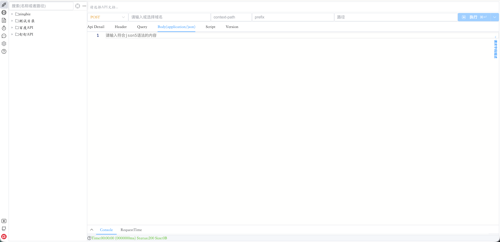
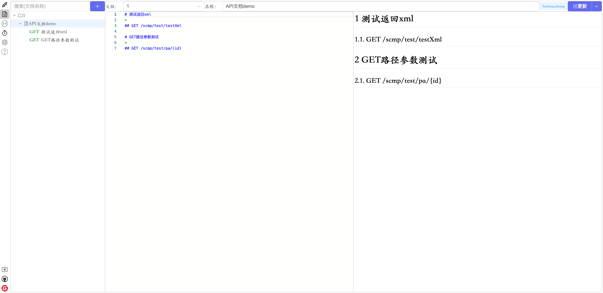
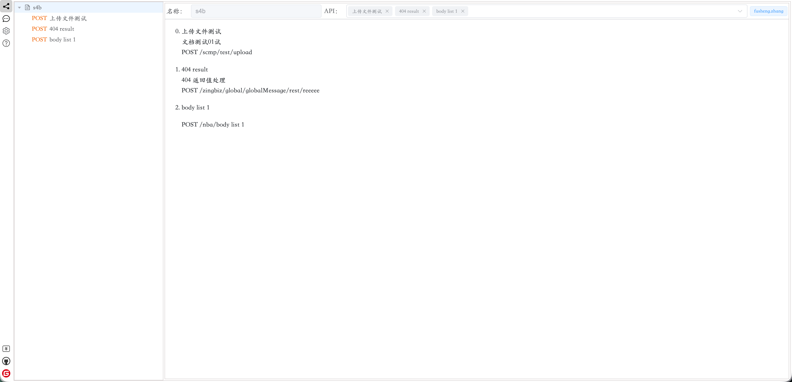
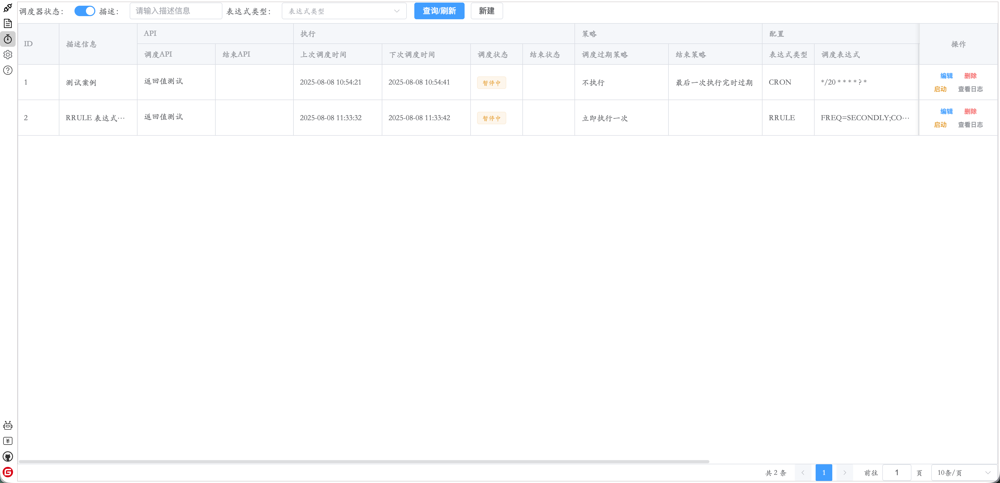

# 项目概要

本仓库（scmp）是一个多功能的 API 管理与测试平台，旨在为开发者和测试人员提供便捷的 API 管理、配置、调试和文档生成服务。主要特性如下：

- 内置多种 API 测试功能。
- 支持 RESTful API，支持多种请求方法和自定义请求头、参数、Body 等。
- 可视化配置和拖拽排序。
- 集成 Swagger 文档解析，方便快速查看已有 API 文档。
- 自由组合API形成需求文档
- 也是一个调度中心

本项目适合中大型团队协作及个人项目 API 管理需求，详细使用方法与功能介绍请参考仓库中的 README.md 文件。

# 截图概览






# 本地部署

## 下载资源

> 从[https://github.com/fushengruomengzhang/API-scmp](https://github.com/fushengruomengzhang/API-scmp)
> 或者[https://gitee.com/fusheng_zhang/API-scmp](https://gitee.com/fusheng_zhang/API-scmp)下载,
> 从source目录获取资源,包含 scmp.jar lib/other/*.jar sqlit-db.db static

## 启动脚本

> jdk8

```shell
java -jar scmp.jar \
	--db.type=sqlit \
	--spring.datasource.url=jdbc:sqlite:./sqlit-db.db \ # 配置为你的salit-db.db 路径
	--project.location-file-path=file:./static/ \ # 配置为你的static目录路径
	--project.socket.ports=3501 \ # webSocket 端口配置
	--spring.profiles.active=pro >/dev/null 2>&1 & # 如果要控制台启动，可以不使用这一行，同时注意去掉上一行结果的反斜杠/
```

```batch
java -jar .\scmp.jar --db.type=sqlit --spring.datasource.url=jdbc:sqlite:./sqlit-db.db --project.location-file-path=file:./static/
```

# 此项目也可以支持服务器部署，如有需要同我联系

邮箱：17610759800@163.com qq:1270622569 微信: zfs1270622569

## 访问

[http://127.0.0.1:3500/scmp/static/index.html#/request/api](http://127.0.0.1:3500/scmp/static/index.html#/request/api)

# 试用地址

[http://182.92.210.97/scmp/static/index.html#/request/api](http://182.92.210.97/scmp/static/index.html#/request/api)

# 使用文档

[使用文档](NBA-API.md)

# 感谢打赏


